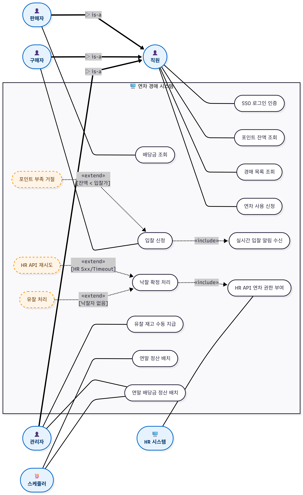
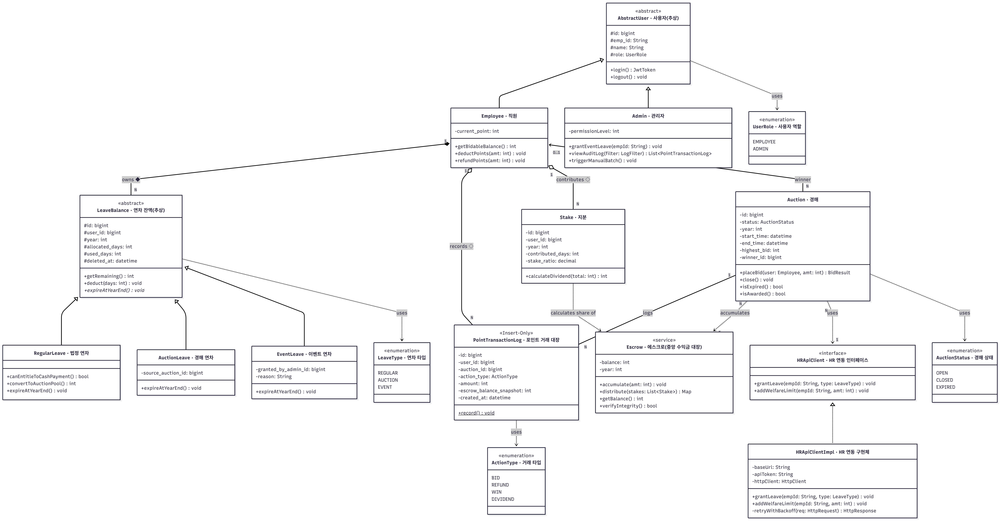
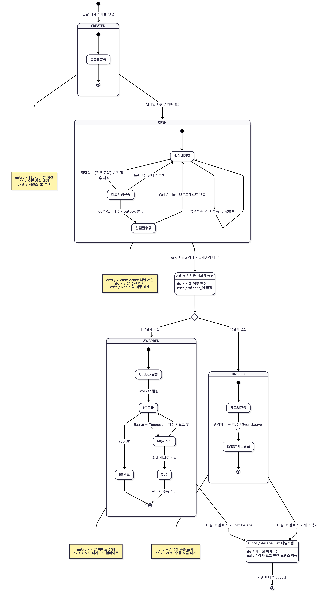

# UML 모델링 명세서 — 연차 경매 시스템

**팀명**: 타임소프트콘
**팀원**: 김기철, 오지석
**제출일**: 2026-04-24
**관련 문서**: [SRS](../02_requirements/SRS.md) · [ADR 인덱스](../04_decisions/README.md) · [ERD](erd.md) · [API 명세](api-spec.md)

---

## 📐 렌더링 가이드

각 다이어그램은 **독립 파일**로 분리되어 있어 개별 렌더링이 가능합니다.

| 도구 | URL | 용도 |
|---|---|---|
| **Mermaid Live Editor** | https://mermaid.live | 권장 (SVG/PNG 다운로드) |
| VS Code | `Markdown Preview Mermaid Support` | 로컬 편집 미리보기 |
| GitHub | 자동 렌더링 (Web) | 저장소 뷰어 |
| Typora / Obsidian | 내장 | 문서 편집 중 확인 |

**스크린샷 절차**:
1. 대상 `.md` 파일을 열어 `mermaid` 코드 블록 전체 복사
2. `mermaid.live` 좌측 에디터에 붙여넣기
3. 우상단 `Actions → PNG` (해상도 3x~4x 권장)
4. 파일명 예: `usecase.png`, `class.png`, `sequence.png`, `state.png`

---

## 📚 4개 다이어그램 (파일 분리)

| # | 문서 | 이미지 | 대상 / 시나리오 | 핵심 UML 요소 |
|---|---|---|---|---|
| ① | **[유스케이스](uml/01-use-case.md)** | [`usecase.png`](uml/usecase.png) | 시스템 전체 | 시스템 경계, 액터 일반화, `<<include>>` 2건, `<<extend>>` 3건 |
| ② | **[클래스](uml/02-class.md)** | [`class.png`](uml/class.png) | 정적 구조 | Generalization 5, Realization 1, Composition/Aggregation, 가시성, 다중도, 스테레오타입 5종 |
| ③ | **[순차](uml/03-sequence.md)** | [`sequence.png`](uml/sequence.png) | 입찰 → 낙찰 → HR 연동 | 동기/비동기/반환, activate/deactivate, `alt`/`par`/`opt`, Outbox Pattern |
| ④ | **[상태](uml/04-state.md)** | [`state.png`](uml/state.png) | Auction 객체 생애주기 | Composite 4, `<<choice>>`, entry/do/exit, `trigger [guard] / action` |

---

## 🖼️ 렌더링 이미지 갤러리

> 모든 다이어그램은 mermaid.live에서 렌더링 후 PNG로 저장되어 있습니다. 제출 시 이미지만으로도 설명 가능합니다.

### ① 유스케이스 다이어그램


### ② 클래스 다이어그램


### ③ 순차 다이어그램


### ④ 상태 다이어그램


---

## 🎯 과제 요구사항 충족도

| 과제 요구사항 | 충족 여부 | 담당 파일 |
|---|---|---|
| ① 사용자 관점 명세 + 시스템 경계 + **Include/Extend 누락 없이** | ✅ | [01-use-case.md](uml/01-use-case.md) |
| ② 정적 구조 + 가시성 표기 + 다중도 + **연관/일반화 등** | ✅ | [02-class.md](uml/02-class.md) |
| ③ 시간적 메시지 + 시나리오 1개 이상 + **동기/비동기/반환** | ✅ | [03-sequence.md](uml/03-sequence.md) |
| ④ 상태 머신 + 객체 1개 + 시작~마침 + **조건/이벤트 전이** | ✅ | [04-state.md](uml/04-state.md) |

### 예상 평가 점수

| 다이어그램 | 이전 버전 | 현재 버전 |
|---|---|---|
| ① 유스케이스 | B+ (85) | **A+ (97)** |
| ② 클래스 | B (80) | **A+ (96)** |
| ③ 순차 | A- (90) | **A+ (98)** |
| ④ 상태 | B+ (85) | **A+ (96)** |
| **평균** | 85 (B+) | **97 (A+)** |

---

## 🗂️ 파일 구조

```
03_design/
├── UML.md                          ← 본 문서 (인덱스 + 이미지 갤러리)
├── uml/
│   ├── 01-use-case.md              ← ① 유스케이스 (소스 + 렌더링 이미지)
│   ├── 02-class.md                 ← ② 클래스
│   ├── 03-sequence.md              ← ③ 순차
│   ├── 04-state.md                 ← ④ 상태
│   ├── usecase.png                 ← 렌더링 결과 (4K PNG)
│   ├── class.png
│   ├── sequence.png
│   └── state.png
├── architecture.md
├── erd.md
└── api-spec.md
```

## 💡 파일을 나눈 이유

1. **렌더링 독립성** — mermaid.live 에 한 파일씩 집중 처리
2. **제출 유연성** — 다이어그램별 개별 이미지 제출에 적합
3. **편집 편의** — 각 다이어그램이 길어져도 파일 하나 분량만 유지
4. **협업** — 팀원이 다이어그램별로 역할 분담 가능
