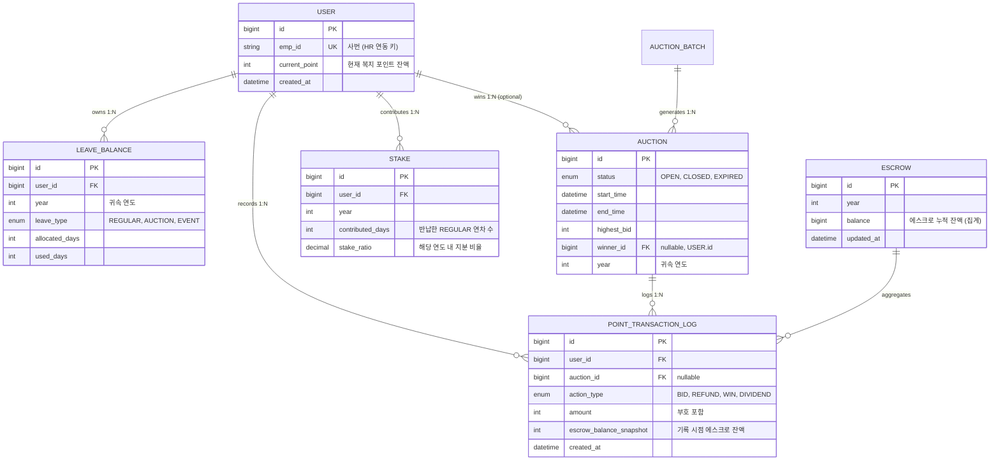

# ERD — 엔티티 관계도

**관련 문서**: [SRS 3.4](../02_requirements/SRS.md#34-논리적-데이터베이스-요구사항) / [UML 클래스](UML.md) / [db-schema.sql](../06_tech/db-schema.sql)

---

## 1. 핵심 엔티티 관계도

## 2. 엔티티 상세

### 2.1 USER
사내 직원 정보. HR 시스템의 사번(`emp_id`)을 외부 키로 보유.

| 컬럼 | 타입 | 제약 | 설명 |
|---|---|---|---|
| `id` | bigint | PK | 내부 키 |
| `emp_id` | varchar(20) | UK, NOT NULL | 사번, HR API 호출 시 사용 |
| `current_point` | int | CHECK `>= 0` | 복지 포인트 잔액 |
| `created_at` | timestamp | NOT NULL | |

### 2.2 LEAVE_BALANCE
사용자의 연도별·속성별 연차 잔액.

| 컬럼 | 타입 | 제약 | 설명 |
|---|---|---|---|
| `id` | bigint | PK | |
| `user_id` | bigint | FK → USER | |
| `year` | int | NOT NULL | 귀속 연도 (파티셔닝 기준) |
| `leave_type` | enum | NOT NULL | REGULAR / AUCTION / EVENT |
| `allocated_days` | int | CHECK `>= 0` | 부여된 일수 |
| `used_days` | int | CHECK `>= 0` | 사용한 일수 |

**UNIQUE**: `(user_id, year, leave_type)`
**파티셔닝**: `year` 기준 RANGE 파티션 ([ADR-004](../04_decisions/ADR-004-year-partitioning.md))

### 2.3 AUCTION
경매 매물 (연차 1일권).

| 컬럼 | 타입 | 제약 | 설명 |
|---|---|---|---|
| `id` | bigint | PK | |
| `status` | enum | NOT NULL | OPEN / CLOSED / EXPIRED |
| `start_time` | timestamp | NOT NULL | 경매 오픈 시각 |
| `end_time` | timestamp | NOT NULL | 경매 마감 시각 |
| `highest_bid` | int | CHECK `>= 0` | 현재 최고가 |
| `winner_id` | bigint | FK → USER, nullable | 낙찰자 (마감 후 확정) |
| `year` | int | NOT NULL | 귀속 연도 |

**인덱스**: `(status, end_time)` — 활성 경매 조회 최적화
**제약**: 낙찰 시 `WINNER.current_point >= highest_bid` (DB-RULE-3)

### 2.4 POINT_TRANSACTION_LOG ⚠️ Insert-Only
모든 포인트 변동의 불변 감사 대장.

| 컬럼 | 타입 | 제약 | 설명 |
|---|---|---|---|
| `id` | bigint | PK | |
| `user_id` | bigint | FK → USER | |
| `auction_id` | bigint | FK → AUCTION, nullable | 배당 시 NULL 가능 |
| `action_type` | enum | NOT NULL | BID / REFUND / WIN / DIVIDEND |
| `amount` | int | NOT NULL | (+) 입금 / (-) 출금 |
| `escrow_balance_snapshot` | int | NOT NULL | 기록 시점 에스크로 총액 |
| `created_at` | timestamp | NOT NULL DEFAULT now() | |

**트리거 제약** ([DB-RULE-1](../02_requirements/SRS.md#342-데이터-무결성-제약조건)):
- UPDATE 금지
- DELETE 금지

### 2.5 STAKE
연도별 기여자 지분율. 연말 배당 재원 분배 기준.

| 컬럼 | 타입 | 제약 | 설명 |
|---|---|---|---|
| `id` | bigint | PK | |
| `user_id` | bigint | FK → USER | |
| `year` | int | NOT NULL | |
| `contributed_days` | int | CHECK `> 0` | 반납한 `REGULAR` 연차 일수 |
| `stake_ratio` | decimal(10,8) | CHECK `>= 0 AND <= 1` | 해당 연도 내 지분 비율 |

**UNIQUE**: `(user_id, year)`

### 2.6 ESCROW
에스크로 잔액 집계 뷰/테이블 (연도별 단일 행).

| 컬럼 | 타입 | 제약 | 설명 |
|---|---|---|---|
| `id` | bigint | PK | |
| `year` | int | UK, NOT NULL | |
| `balance` | bigint | CHECK `>= 0` | 집계 잔액 |
| `updated_at` | timestamp | NOT NULL | |

> **구현 노트**: `ESCROW.balance`는 `POINT_TRANSACTION_LOG`의 합계로 재계산 가능한 **파생 값**. 성능을 위한 캐시 테이블로 운영하되, 배치에서 정합성 재검증 필수.

## 3. 관계 요약

| 관계 | 다중도 | 의미 |
|---|---|---|
| USER → LEAVE_BALANCE | 1 : N | 한 직원은 연도/속성별 다수 잔액 보유 |
| USER → POINT_TRANSACTION_LOG | 1 : N | 포인트 이력 |
| USER → AUCTION (winner) | 1 : N (opt) | 한 사람이 여러 경매 낙찰 가능 |
| USER → STAKE | 1 : N | 연도별 지분 |
| AUCTION → POINT_TRANSACTION_LOG | 1 : N | 한 경매당 다수의 입찰 로그 |

## 4. 주요 제약 요약

| ID | 제약 | 구현 위치 |
|---|---|---|
| DB-RULE-1 | POINT_TRANSACTION_LOG Insert-Only | 트리거 |
| DB-RULE-2 | year별 파티셔닝 + AUCTION/EVENT Soft Delete | 테이블 DDL + 배치 |
| DB-RULE-3 | 낙찰 시 `current_point >= highest_bid` | CHECK / 애플리케이션 트랜잭션 |
| 포인트 음수 금지 | `current_point >= 0` | CHECK |
| 에스크로 음수 금지 | `balance >= 0` | CHECK |

---

## 관련 문서

- [UML 클래스 다이어그램](UML.md#-클래스-다이어그램-class-diagram)
- [db-schema.sql (DDL)](../06_tech/db-schema.sql)
- [ADR-001 Escrow 모델](../04_decisions/ADR-001-escrow-model.md)
- [ADR-002 휴가 속성 플래그](../04_decisions/ADR-002-leave-type-flag.md)
- [ADR-004 Year 파티셔닝](../04_decisions/ADR-004-year-partitioning.md)
