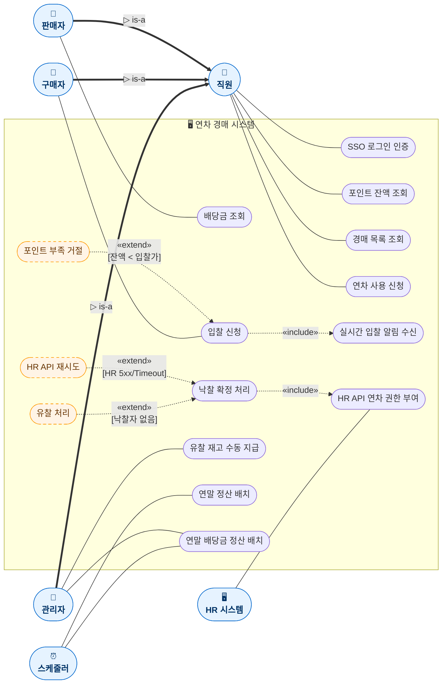

# ① 유스케이스 다이어그램 (Use Case Diagram)

**대상 시스템**: 연차 경매 시스템
**팀**: 타임소프트콘 (김기철, 오지석)
**렌더링**: https://mermaid.live (하단 코드 블록 복사 → 붙여넣기 → PNG 다운로드)

> **사용자 관점 서비스 명세** — 6 액터(일반화 3건) · 15 유스케이스 · `<<include>>` 2건 · `<<extend>>` 3건

---

## 🧠 액터 분석 결과 요약

시스템 역할(role) 기반으로 액터를 설계 (인물이나 근속연수가 아님).

```
직원 (Employee) ◀━━━ base actor (모두가 상속)
  ├─ 판매자 (Seller)    ▷ is-a 직원  — 공용 풀에 연차 기여 + 배당 수령
  ├─ 구매자 (Buyer)     ▷ is-a 직원  — 경매 참여 + 낙찰 시 연차 획득
  └─ 관리자 (Admin)     ▷ is-a 직원  — 유찰 재고 EVENT 지급 등

[외부 액터]
  • 스케줄러 (Batch)    — 12/31 자동 정산 배치
  • HR 시스템           — API 호출 수신 (Secondary)
```

> 📌 **동일 직원이 여러 역할 동시 수행 가능**: 예를 들어 김 사원은 1월에는 판매자(전년도 반납분 배당 수령), 3월에는 구매자(입찰 참여), 관리 권한 부여 시 관리자 역할도 가능.

---

## 🎯 설계 요소 커버리지

- ✅ **시스템 경계** (System Boundary) 명확
- ✅ **액터 일반화** (Actor Generalization) **3건**: 직원 ← 판매자 / 구매자 / 관리자
- ✅ **`<<include>>`** 2건 (필수 흐름 재사용)
- ✅ **`<<extend>>`** 3건 (조건부 예외 흐름)
- ✅ 외부 액터(HR 시스템, 스케줄러) 포함
- ✅ Primary/Secondary 액터 구분

---

## 📊 다이어그램



### 🖼️ 렌더링 결과


> 📸 mermaid.live에서 렌더링한 이미지. 소스 변경 시 재렌더링하여 `usecase.png`로 덮어쓰기.

---

## 📝 관계 요약

| 관계 유형 | 건수 | 상세 |
|---|---|---|
| **액터 일반화** | **3** | 직원 ← 판매자 / 구매자 / 관리자 |
| **`<<include>>`** | 2 | UC4→UC5 (필수 알림), UC6→UC7 (필수 HR 연동) |
| **`<<extend>>`** | 3 | 포인트 부족 거절 → 입찰 신청 / HR API 재시도 → 낙찰 확정 / 유찰 처리 → 낙찰 확정 |
| **Association** | 11 | 액터 ↔ 유스케이스 연결 |

## 👥 액터별 유스케이스 매핑

| 액터 | 유형 | 담당 유스케이스 | 비고 |
|---|---|---|---|
| **직원** | Primary / base | SSO 로그인, 포인트 조회, 경매 조회, 연차 사용 | 상속 통해 모든 파생 역할이 공유 |
| **판매자** | Primary | 배당금 조회 | 공용 풀에 연차 기여한 자 (Stake 보유) |
| **구매자** | Primary | 입찰 신청 (+ 실시간 알림 include) | 경매 입찰 참여자 |
| **관리자** | Primary | 배당 정산 배치 트리거, 유찰 재고 EVENT 지급 | RBAC로 분리된 권한, 감사 로그 열람 가능 |
| **스케줄러** | System | 연말 정산 배치, 연말 배당금 정산 배치 | 12/31 자동 실행 |
| **HR 시스템** | **Secondary** | HR API 연차 권한 부여 (수신) | API 호출 수신만, 능동 행위 없음 |

## 🧩 역할 구분의 운영상 의미

- 동일 직원이 시점별로 여러 역할을 동시 보유 가능 (예: 판매자이자 구매자)
- 시스템은 역할을 **컨텍스트별로 식별**:
  - 세션 시작: 직원 (로그인)
  - 입찰 시: 구매자 역할 활성
  - 배당 조회 시: 판매자 역할 활성 (Stake 검증)
  - 관리 API 접근 시: 관리자 역할 활성 (RBAC 검증)

## 📎 SRS/ADR 매핑

| 유스케이스 | SRS | ADR |
|---|---|---|
| 입찰 신청 | FR-2.1 | ADR-006 |
| 낙찰 확정 처리 | FR-2.2 | ADR-001, ADR-005 |
| HR API 연차 권한 부여 | FR-2.3 | ADR-005 |
| 연차 사용 신청 | FR-3.1 | ADR-002, ADR-003 |
| 배당금 조회 | SRS 3.5 | ADR-001, ADR-008 |
| 연말 정산 배치 | FR-1.1 | ADR-008 |
| 연말 배당금 정산 배치 | FR-4.1 | ADR-001, ADR-008 |
| 유찰 재고 수동 지급 | FR-4.2 | ADR-007 |
| [extend] 포인트 부족 거절 | DB-RULE-3 | — |
| [extend] HR API 재시도 | FR-2.3 예외 | **ADR-005** |
| [extend] 유찰 처리 | FR-4.2 | — |

---

## 🧭 내비게이션

| | 문서 |
|---|---|
| ↩️ 인덱스 | [UML 인덱스](../UML.md) |
| ➡️ 다음 | [② 클래스 다이어그램](02-class.md) |
| 📚 관련 | [SRS](../../02_requirements/SRS.md) · [용어집](../../02_requirements/glossary.md) · [ADR](../../04_decisions/README.md) |
