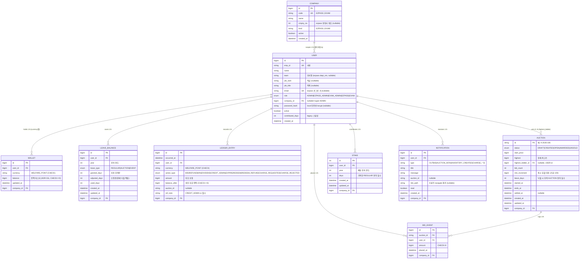

# ERD — 엔티티 관계도

**상태**: 🟢 v3 — 코드(`backend/prisma/schema.prisma`) 기준 동기화: **2026-06-12**
**관련 문서**: [SRS 3.4](../02_requirements/SRS.md#34-논리적-데이터베이스-요구사항) / [UML 클래스](uml/02-class.md) / [schema.prisma](../../backend/prisma/schema.prisma) / [ADR-010](../04_decisions/ADR-010-currency-abstraction.md) / [ADR-011](../04_decisions/ADR-011-welfare-point-ownership.md) / [ADR-017](../04_decisions/ADR-017-leave-pool-context.md)

---

> ## ⚙️ 코드 기준 동기화 메모 (2026-06-12)
>
> 이 문서는 **실제 `backend/prisma/schema.prisma` + `backend/prisma/migrations/`** 와 1:1 동기화되었다.
> 설계 초안(v2)과 실제 구현이 갈리는 핵심:
>
> - **DB 엔진은 SQLite**(파일 기반, 외부 서버 없음). Prisma SQLite 커넥터는 `enum` 블록을 지원하지 않으므로,
>   논리적 enum(`role` / `currency` / `action_type` / `status` / `leave_type` …)은 **`String` 컬럼 + DB-level `CHECK (… IN (…))` 제약**으로 표현된다. 아래 ERD의 `enum` 표기는 전부 "논리적 enum = String+CHECK"로 읽으면 된다. 허용값은 각 엔티티 표의 CHECK 칸에 명시.
> - **PK 타입**: Prisma 스키마상 `BigInt @default(autoincrement())`지만 SQLite는 `INTEGER PRIMARY KEY AUTOINCREMENT`(rowid)만 자동 채번하므로 init 마이그레이션이 INTEGER로 선언한다(64-bit 저장, BigInt로 read-back). 일부 후발 테이블(`stake` / `leave_pool_run` / `leave_pool_supply` / `leave_pool_release_run` / `outbox` / `redemption_*` / `charge_request` / `release_policy`)은 Prisma 모델에서 아예 `Int` PK로 강등됨. ERD에선 `bigint`/`int`를 모델 정의대로 표기.
> - **멀티테넌시**: 거의 모든 테넌트 테이블에 `company_id`(FK→`company`) 가 있다. `user.company_id = null` 은 super ADMIN(전 회사 통합). FK는 마이그레이션 레벨에서 부여(스키마는 스칼라만 — 백릴레이션 클러터 회피).
> - **ESCROW 테이블은 존재하지 않는다.** 에스크로 잔액은 **`ledger_entry` 합계로 파생**(`Σ(BID+WIN) − Σ(REFUND+DIVIDEND) = 에스크로 잔액`, 통화별, DB-RULE-4). 별도 escrow 캐시 테이블 없음 → v2의 `ESCROW` 엔티티는 제거.
> - **AUCTION_BATCH 라는 테이블은 없다.** 그 역할은 `leave_pool_run`(연말 풀 수집 멱등 마커, ADR-017)이 한다.
> - **DB-RULE-1**(ledger INSERT-only)은 init 마이그레이션의 `ledger_entry_no_update` / `ledger_entry_no_delete` **트리거**로 실제 구현되어 유지된다.

---

## 1. 핵심 엔티티 관계도

> 테이블이 많아 가독성을 위해 **(A) 거래/경매 코어**와 **(B) 연말 풀·교환·운영** 두 다이어그램으로 분리한다. 전체 테이블 목록은 §2 참고(빠짐 없음).

### (A) 거래 · 경매 · 연차 코어

> **에스크로 잔액은 별도 테이블이 아니라 `LEDGER_ENTRY` 합계로 파생**된다 (DB-RULE-4, 통화별):
> `Σ(BID+WIN) − Σ(REFUND+DIVIDEND) = 에스크로 잔액` (CREDIT_ADMIN 제외). `stake_ratio`(지분 비율)도 테이블 컬럼이 아니라 **앱 레이어에서 해당 연도 `stake.days` 합 대비 동적 계산**된다.

### (B) 연말 풀 수집 · 발행 · 교환 · 운영

```mermaid
erDiagram
    COMPANY ||--o{ LEAVE_POOL_RUN : "1:N (연도별 수집)"
    COMPANY ||--o{ LEAVE_POOL_RELEASE_RUN : "1:N (발행 회차)"
    COMPANY ||--o{ OUTBOX : "1:N"
    USER ||--o{ LEAVE_POOL_SUPPLY : "contributes 1:N"
    USER ||--o{ REDEMPTION_ORDER : "places 1:N"
    USER ||--o{ REDEMPTION_REQUEST : "requests 1:N"
    USER ||--o{ CHARGE_REQUEST : "requests 1:N"
    REDEMPTION_ITEM ||--o{ REDEMPTION_ORDER : "1:N"
    REDEMPTION_ITEM ||--o{ REDEMPTION_REQUEST : "1:N"
    REDEMPTION_ITEM ||--o{ REDEMPTION_ITEM_AUDIT : "1:N"

    LEAVE_POOL_RUN {
        int id PK
        int source_year "수집 대상 연도"
        int target_year "생성 매물 연도 = source+1"
        bigint company_id FK
        int contributor_count
        int days_collected
        int auctions_created
        string status "기본 DONE"
        datetime ran_at
    }

    LEAVE_POOL_SUPPLY {
        int id PK
        int target_year
        bigint company_id FK
        bigint user_id FK
        int contributed_days "최초 기여 일수(불변)"
        int remaining_days "미발행 잔여 일수"
        datetime created_at
        datetime updated_at
    }

    LEAVE_POOL_RELEASE_RUN {
        int id PK
        int target_year
        bigint company_id FK
        string period_index "회차 식별자(주/월/일)"
        string cadence
        int released_qty
        datetime ran_at
    }

    RELEASE_POLICY {
        int id PK "싱글톤(id=1, CHECK)"
        bigint company_id FK
        string cadence "none|daily|weekly|monthly (CHECK)"
        int day_of_week "0~6 (nullable)"
        int day_of_month "1~31 (nullable)"
        string time_of_day "HH:MM (nullable)"
        int quantity "1회 발행 수 (nullable)"
        bigint start_price "발행 매물 시작가 (nullable)"
        datetime updated_at
    }

    OUTBOX {
        int id PK
        string topic "예: HR_LEAVE_GRANT"
        string payload "JSON 문자열"
        string status "PENDING|SENT|DEAD"
        int attempts
        int max_attempts "기본 5"
        datetime next_attempt_at
        string last_error "nullable"
        datetime created_at
        datetime sent_at "nullable"
        bigint company_id FK
    }

    REDEMPTION_ITEM {
        int id PK
        bigint company_id FK
        string sku UK
        string name
        string brand "nullable"
        string description "nullable"
        bigint price_p "교환 차감 포인트 (CHECK>=0)"
        int stock "nullable=무제한"
        boolean active
        string category "nullable"
        int display_order
        datetime created_at
        datetime updated_at
    }

    REDEMPTION_ITEM_AUDIT {
        int id PK
        int item_id FK
        bigint company_id FK
        bigint actor_user_id "nullable"
        string action "CREATE|UPDATE|ACTIVATE|DEACTIVATE|DELETE"
        string before "JSON (nullable)"
        string after "JSON (nullable)"
        datetime created_at
    }

    REDEMPTION_ORDER {
        int id PK
        bigint user_id FK
        int item_id FK
        bigint price_p_at_redeem "가격 스냅샷"
        string status "PENDING|FULFILLED|FAILED|REFUNDED (CHECK)"
        string delivery_ref "nullable"
        datetime created_at
        datetime updated_at
        bigint company_id FK
    }

    REDEMPTION_REQUEST {
        int id PK
        bigint user_id FK
        int item_id FK
        bigint price_p_at_request "가격 스냅샷"
        string note "nullable"
        string status "PENDING|APPROVED|RECEIVED|REJECTED (CHECK)"
        string coupon_code "승인 시 발급 (nullable)"
        bigint decided_by FK "결정 관리자 (nullable)"
        datetime decided_at "nullable"
        string decision_note "nullable"
        datetime received_at "nullable"
        datetime created_at
        datetime updated_at
        bigint company_id FK
    }

    CHARGE_REQUEST {
        int id PK
        bigint user_id FK
        bigint amount "CHECK>0"
        string note "nullable"
        string status "PENDING|APPROVED|REJECTED (CHECK)"
        bigint decided_by FK "결정 관리자 (nullable)"
        datetime decided_at "nullable"
        string decision_note "nullable"
        datetime created_at
        datetime updated_at
        bigint company_id FK
    }
```

> **v3 변경 요약**(v2 → 코드 동기화):
> - **추가**: `COMPANY`, `BID_EVENT`, `NOTIFICATION`, `LEAVE_POOL_RUN`, `LEAVE_POOL_SUPPLY`, `LEAVE_POOL_RELEASE_RUN`, `OUTBOX`, `RELEASE_POLICY`, `REDEMPTION_ITEM`, `REDEMPTION_ITEM_AUDIT`, `REDEMPTION_ORDER`, `REDEMPTION_REQUEST`, `CHARGE_REQUEST`.
> - **제거**: `ESCROW`(테이블 없음 — ledger 파생), `AUCTION_BATCH`(→ `LEAVE_POOL_RUN`).
> - **정정**: `WALLET`(복합 PK → surrogate `id` PK + `(user_id,currency)` UNIQUE), `LEAVE_BALANCE`(`allocated_days`→`granted_days`+`adjusted_days`, `deleted_at` 제거), `AUCTION`(PK String + `started_at`/`ends_at`/`highest`/`highest_bidder_id`, `year` 컬럼 제거, status 5값), `LEDGER_ENTRY`(`escrow_balance_snapshot`/`reason`→`balance_after`/`ref_note`, `created_at`→`occurred_at`, action_type 10값), `STAKE`(`contributed_days`+`stake_ratio`→`days` 단일), `USER`(role 5값 + team/job_rank/job_title/email/password_hash/active/company_id 등).

## 2. 엔티티 상세 (전체 테이블 목록)

| # | 테이블(`@@map`) | Prisma 모델 | PK 타입 | 역할 |
|---|---|---|---|---|
| 1 | `company` | Company | bigint | 멀티테넌시 루트 (EZPASS/EXAM) |
| 2 | `users` | User | bigint | 직원/관리자. 신원은 ezpass 기준(ADR-020) |
| 3 | `wallet` | Wallet | bigint | 화폐별 잔액 마스터 (ADR-011) |
| 4 | `ledger_entry` | LedgerEntry | bigint | Insert-Only 거래 대장 (DB-RULE-1) |
| 5 | `auction` | Auction | **string** | 경매 매물 |
| 6 | `bid_event` | BidEvent | bigint | 수락된 입찰 append-only 로그 |
| 7 | `leave_balance` | LeaveBalance | bigint | 연차 잔액 마스터 (ADR-016) |
| 8 | `stake` | Stake | int | 연도별 배당 지분 스냅샷 (ADR-017) |
| 9 | `notification` | Notification | bigint | 도메인 이벤트 알림 (ADR-013) |
| 10 | `leave_pool_run` | LeavePoolRun | int | 연말 풀 수집 멱등 마커 (구 AUCTION_BATCH 역할) |
| 11 | `leave_pool_supply` | LeavePoolSupply | int | 풀 재고(기여자별 잔여 일수) |
| 12 | `leave_pool_release_run` | LeavePoolReleaseRun | int | 발행 회차 멱등 마커 |
| 13 | `release_policy` | ReleasePolicy | int | 매물 발행 분산 정책(싱글톤 id=1) |
| 14 | `outbox` | OutboxMessage | int | 트랜잭션 아웃박스 (외부 HR 호출) |
| 15 | `redemption_item` | RedemptionItem | int | 포인트 교환 상품 카탈로그 (ADR-023) |
| 16 | `redemption_item_audit` | RedemptionItemAudit | int | 카탈로그 변경 이력 |
| 17 | `redemption_order` | RedemptionOrder | int | 즉시 교환 1건(레거시 흐름) |
| 18 | `redemption_request` | RedemptionRequest | int | 교환 신청→승인→수령 워크플로 |
| 19 | `charge_request` | ChargeRequest | int | 충전 요청→승인 워크플로 (ADR-024) |

### 2.1 USER (`users`)
사내 직원/관리자. 신원·조직(이름/부서/직급/직책/role)은 ezpass에서 동기화(ADR-019/020). **잔액·연차 컬럼은 보유하지 않음**(각각 `wallet`/`leave_balance`로 분리). `contributed_days`는 legacy 디스플레이 스냅샷.

| 컬럼 | 타입 | 제약 | 설명 |
|---|---|---|---|
| `id` | bigint(INTEGER autoinc) | PK | 내부 키 |
| `emp_id` | text | UK, NOT NULL | 사번 |
| `name` | text | NOT NULL | 이름 |
| `team` / `job_rank` / `job_title` | text | nullable | ezpass 동기화 표시용 |
| `email` | text | UK, nullable | ezpass 로그인 키 (ADR-019) |
| `role` | text(enum) | NOT NULL DEFAULT `EXAM` | **CHECK IN (`ADMIN`,`EZPASS_ADMIN`,`EXAM_ADMIN`,`EZPASS`,`EXAM`)** |
| `company_id` | bigint | FK→company, nullable | null = super ADMIN(전 회사 통합) |
| `password_hash` | text | nullable | local 인증(AUTH_MODE=local) bcrypt (ADR-022) |
| `active` | boolean | DEFAULT true | 비활성 시 로그인 거부 |
| `contributed_days` | int | CHECK `>= 0` | legacy 스냅샷 |
| `created_at` | datetime | DEFAULT now() | |

### 2.2 WALLET (`wallet`)
사용자의 화폐별 잔액 마스터(ADR-010/011). 본 시스템이 단일 진실 공급원.

| 컬럼 | 타입 | 제약 | 설명 |
|---|---|---|---|
| `id` | bigint | PK | **surrogate PK (복합 PK 아님)** |
| `user_id` | bigint | FK→users | |
| `currency` | text | **CHECK IN (`WELFARE_POINT`)** | 화폐 코드 |
| `balance` | bigint | CHECK `>= 0`, DEFAULT 0 | 잔액 |
| `updated_at` | datetime | @updatedAt | |
| `company_id` | bigint | FK→company | |

**UNIQUE**: `(user_id, currency)` (`uq_wallet_user_currency`) — 다중 화폐 대비
**구현 노트**: `WelfarePointProvider`(ADR-010 `BiddingCurrency` 구현체)만 이 테이블을 조작. 코어 도메인 직접 접근 금지.

### 2.3 LEAVE_BALANCE (`leave_balance`)
사용자의 연도별·속성별 연차 잔액 마스터(ADR-016). ezpass `tbl_user_yryc` 구조 차용. **Soft Delete(`deleted_at`) 컬럼은 없음** — 연도-파티셔닝 `(user_id, year, leave_type)` UNIQUE로 대체.

| 컬럼 | 타입 | 제약 | 설명 |
|---|---|---|---|
| `id` | bigint | PK | |
| `user_id` | bigint | FK→users | |
| `year` | int | NOT NULL | 귀속 연도 |
| `leave_type` | text(enum) | **CHECK IN (`REGULAR`,`AUCTION`,`EVENT`)** | ADR-002 3-flag |
| `granted_days` | int | CHECK `>= 0`, DEFAULT 0 | 자동 부여분 (ezpass atmc_yryc_day_qty) |
| `adjusted_days` | int | CHECK `>= 0`, DEFAULT 0 | 조정분 — 경매 낙찰 적립분 (mdat_yryc_day_qty) |
| `used_days` | int | CHECK `>= 0`, DEFAULT 0 | 사용분 |
| `created_at` / `updated_at` | datetime | | |
| `company_id` | bigint | FK→company | |

**잔여 일수** = `granted_days + adjusted_days − used_days` (앱 레이어 계산).
**UNIQUE**: `(user_id, year, leave_type)` (`uq_leave_user_year_type`)

### 2.4 AUCTION (`auction`)
경매 매물(연차 1일권). **PK는 String**(예 `A-2026-106`) — 디자인 목업 ID와 1:1.

| 컬럼 | 타입 | 제약 | 설명 |
|---|---|---|---|
| `id` | **text** | PK | 사람이 읽는 ID (예 `A-2026-106`) |
| `status` | text(enum) | DEFAULT `CREATED`, **CHECK IN (`DRAFT`,`CREATED`,`OPEN`,`AWARDED`,`UNSOLD`)** | CUT-3: State 패턴 대신 status 문자열 + guard |
| `start_price` | bigint | CHECK `>= 0` | 시작가 |
| `highest` | bigint | CHECK `>= 0` | 현재 최고가 |
| `highest_bidder_id` | bigint | FK→users, nullable | 현재 최고 입찰자(=정산 시 낙찰자) |
| `bid_count` | int | CHECK `>= 0` | 입찰 수 |
| `min_increment` | bigint | CHECK `> 0`, DEFAULT 100 | 최소 입찰 단위 |
| `leave_days` | int | CHECK `>= 0`, DEFAULT 1 | 낙찰 시 부여 AUCTION 연차 일수 |
| `started_at` / `ends_at` | datetime | `ends_at > started_at` | 오픈/마감 시각 |
| `settled_at` | datetime | nullable | 정산 시각 |
| `created_at` / `updated_at` | datetime | | |
| `company_id` | bigint | FK→company | |

**`year` 컬럼은 없음**(연도는 `id`/`started_at`에서 파생).
**인덱스**: `(status, ends_at)`, `(company_id, status)`.

### 2.5 BID_EVENT (`bid_event`)
수락된 입찰의 append-only 로그. `ledger_entry`(돈)와 분리 — 이쪽은 경매 액션을 추적.

| 컬럼 | 타입 | 제약 | 설명 |
|---|---|---|---|
| `id` | bigint | PK | |
| `auction_id` | text | FK→auction | |
| `user_id` | bigint | FK→users | |
| `amount` | bigint | CHECK `> 0` | 입찰가 |
| `placed_at` | datetime | DEFAULT now() | |
| `company_id` | bigint | FK→company | |

### 2.6 LEDGER_ENTRY (`ledger_entry`) ⚠️ Insert-Only
모든 콘 변동의 불변 감사 대장.

| 컬럼 | 타입 | 제약 | 설명 |
|---|---|---|---|
| `id` | bigint | PK | |
| `occurred_at` | datetime | DEFAULT now() | 발생 시각 (구 `created_at`) |
| `user_id` | bigint | FK→users | |
| `currency` | text | **CHECK IN (`WELFARE_POINT`)** | |
| `action_type` | text(enum) | **CHECK IN (10종)** | `BID`,`REFUND`,`WIN`,`DIVIDEND`,`CREDIT_ADMIN`,`EXPIRE`,`REDEEM`,`REDEEM_REFUND`,`CHARGE_REQUESTED`,`CHARGE_REJECTED` |
| `amount` | bigint | NOT NULL | (+) 입금 / (-) 출금 |
| `balance_after` | bigint | CHECK `>= 0` | **기록 시점 개인 지갑 잔액** (구 `escrow_balance_snapshot` 아님) |
| `auction_id` | text | nullable | 배당·관리자 적립 시 NULL |
| `ref_note` | text | `CREDIT_ADMIN`일 때 NOT NULL+len>0 | 사유 (구 `reason`) |
| `company_id` | bigint | FK→company | |

**트리거 제약**(DB-RULE-1): `ledger_entry_no_update` / `ledger_entry_no_delete` 트리거가 UPDATE/DELETE를 ABORT. 보정은 `REFUND`/`CREDIT_ADMIN` 등 보상 INSERT로.
**에스크로 잔액**은 이 테이블 합계로 파생(별도 ESCROW 테이블 없음, DB-RULE-4 통화별).

### 2.7 STAKE (`stake`)
연도별 배당 지분 스냅샷(ADR-017). LeavePool 수집이 `(user_id, year)`당 1행 적재 → 배당이 해당 연도 stake를 읽어 분배. **`stake_ratio`는 컬럼이 아니라 앱 레이어 동적 계산**.

| 컬럼 | 타입 | 제약 | 설명 |
|---|---|---|---|
| `id` | **int** | PK | autoincrement BigInt drift 회피 위해 Int 강등 |
| `user_id` | bigint | FK→users | |
| `year` | int | NOT NULL | 배당 귀속 연도(= 수집 targetYear) |
| `days` | int | NOT NULL | 기여한 REGULAR 연차 일수 |
| `created_at` / `updated_at` | datetime | | |
| `company_id` | bigint | FK→company | |

**UNIQUE**: `(user_id, year)` (`uq_stake_user_year`)

### 2.8 NOTIFICATION (`notification`)
도메인 이벤트(ADR-013) 구독 결과물. `NotificationObserver`가 적재.

| 컬럼 | 타입 | 설명 |
|---|---|---|
| `id` | bigint PK | |
| `user_id` | bigint FK | |
| `type` | text | `OUTBID`/`AUCTION_WON`/`INVENTORY_CREATED`/충전·교환 토픽 등 |
| `title` / `message` | text | |
| `auction_id` | text nullable | |
| `link_path` | text nullable | 프론트 navigate 경로 |
| `read` | boolean DEFAULT false | |
| `created_at` | datetime | |
| `company_id` | bigint FK | |

### 2.9 LEAVE_POOL_RUN (`leave_pool_run`) — (구 AUCTION_BATCH 역할)
연말 풀 수집 배치(ADR-017)의 멱등성/감사 마커. `(company_id, target_year)` UNIQUE로 중복 수집 차단.

| 컬럼 | 타입 | 설명 |
|---|---|---|
| `id` | int PK | |
| `source_year` | int | 수집 대상 연도 |
| `target_year` | int | 생성 매물 연도(= source+1) |
| `company_id` | bigint FK | |
| `contributor_count` / `days_collected` / `auctions_created` | int | 집계 |
| `status` | text DEFAULT `DONE` | |
| `ran_at` | datetime | |

**UNIQUE**: `(company_id, target_year)` (`uq_pool_company_target`)

### 2.10 LEAVE_POOL_SUPPLY (`leave_pool_supply`)
풀 "재고". 수집 시 기여자별 잔여 일수만 적재하고, `ReleaseInventoryScheduler`가 정책 주기마다 N개씩 매물로 변환.

| 컬럼 | 타입 | 설명 |
|---|---|---|
| `id` | int PK | |
| `target_year` | int | |
| `company_id` | bigint FK | |
| `user_id` | bigint FK | |
| `contributed_days` | int | 최초 기여(불변, 감사) |
| `remaining_days` | int | 미발행 잔여(0이면 소진) |
| `created_at` / `updated_at` | datetime | |

**UNIQUE**: `(company_id, target_year, user_id)` (`uq_supply_company_year_user`)

### 2.11 LEAVE_POOL_RELEASE_RUN (`leave_pool_release_run`)
Release 회차 멱등 마커.

| 컬럼 | 타입 | 설명 |
|---|---|---|
| `id` | int PK | |
| `target_year` | int | |
| `company_id` | bigint FK | |
| `period_index` | text | 회차 식별자(weekly: yyyyWww, monthly: yyyy-mm …) |
| `cadence` | text | |
| `released_qty` | int | |
| `ran_at` | datetime | |

**UNIQUE**: `(company_id, target_year, period_index)` (`uq_release_company_year_period`)

### 2.12 RELEASE_POLICY (`release_policy`)
풀 수집 매물의 `started_at` 분산 정책(싱글톤).

| 컬럼 | 타입 | 제약 | 설명 |
|---|---|---|---|
| `id` | int | PK, **CHECK `= 1`** | 싱글톤 |
| `company_id` | bigint | FK→company | |
| `cadence` | text | **CHECK IN (`none`,`daily`,`weekly`,`monthly`)** | none=비활성 |
| `day_of_week` | int | CHECK 0~6, nullable | weekly용 |
| `day_of_month` | int | CHECK 1~31, nullable | monthly용 |
| `time_of_day` | text | nullable | `HH:MM` |
| `quantity` | int | CHECK `> 0`, nullable | 1회 발행 수 |
| `start_price` | bigint | nullable | 발행 매물 시작가 |
| `updated_at` | datetime | | |

### 2.13 OUTBOX (`outbox`)
트랜잭션 아웃박스(ADR-005/013). 도메인 변경과 같은 tx에서 "외부 HR로 보낼 메시지"를 적재 → `OutboxRelayScheduler`가 polling 전송.

| 컬럼 | 타입 | 설명 |
|---|---|---|
| `id` | int PK | |
| `topic` | text | 예 `HR_LEAVE_GRANT` |
| `payload` | text | JSON 문자열 |
| `status` | text DEFAULT `PENDING` | `PENDING`/`SENT`/`DEAD`(DLQ) |
| `attempts` / `max_attempts` | int | 재시도(기본 5) |
| `next_attempt_at` | datetime | 지수 백오프 |
| `last_error` | text nullable | |
| `created_at` / `sent_at` | datetime | |
| `company_id` | bigint FK | |

### 2.14 REDEMPTION_ITEM / _AUDIT / _ORDER / _REQUEST (포인트 교환, ADR-023)
자립형 배포의 포인트 소모처. 위임형(기본)에선 미사용.

- **`redemption_item`**: 카탈로그. `sku` UNIQUE, `price_p`(CHECK≥0), `stock`(null=무제한), `brand`/`category`/`display_order`.
- **`redemption_item_audit`**: 카탈로그 변경 이력(`CREATE`/`UPDATE`/`ACTIVATE`/`DEACTIVATE`/`DELETE`), before/after JSON. `item_id` FK(Cascade).
- **`redemption_order`**: 즉시 교환 1건(레거시 흐름). status **CHECK IN (`PENDING`,`FULFILLED`,`FAILED`,`REFUNDED`)**, 가격 스냅샷 `price_p_at_redeem`.
- **`redemption_request`**: 신청→승인→수령 워크플로(현 신규 흐름). status **CHECK IN (`PENDING`,`APPROVED`,`RECEIVED`,`REJECTED`)**, `coupon_code`/`decided_by`/`received_at`, 가격 스냅샷 `price_p_at_request`. 차감 시점은 신청(잔액·재고 잠금이 ADR-001 escrow 모델과 정합).

### 2.15 CHARGE_REQUEST (`charge_request`, ADR-024)
사용자 주도 충전 요청 → 관리자 승인 워크플로.

| 컬럼 | 타입 | 제약 | 설명 |
|---|---|---|---|
| `id` | int PK | | |
| `user_id` | bigint FK | | 요청자 |
| `amount` | bigint | CHECK `> 0` | 요청 금액 |
| `note` | text nullable | | 요청 사유 |
| `status` | text | **CHECK IN (`PENDING`,`APPROVED`,`REJECTED`)** | |
| `decided_by` | bigint FK nullable | | 결정 관리자 |
| `decided_at` / `decision_note` | | | |
| `created_at` / `updated_at` | datetime | | |
| `company_id` | bigint FK | | |

승인 시 같은 tx에서 `CreditWalletAdmin` 실행(ledger `CREDIT_ADMIN`). 결정 이벤트가 `NotificationObserver`로 전달.

## 3. 관계 요약

| 관계 | 다중도 | 의미 |
|---|---|---|
| COMPANY → USER | 1 : N | 회사별 사용자 스코프(멀티테넌시). super ADMIN은 company_id null |
| USER → WALLET | 1 : N | 화폐별 지갑(현재 1개) |
| USER → LEAVE_BALANCE | 1 : N | 연도/속성별 잔액 |
| USER → LEDGER_ENTRY | 1 : N | 콘 이력 |
| USER → BID_EVENT | 1 : N | 입찰 로그 |
| USER → AUCTION (highest_bidder) | 0..N | 다수 경매 낙찰 가능 |
| USER → STAKE | 1 : N | 연도별 지분 |
| USER → NOTIFICATION / *_REQUEST / *_ORDER | 1 : N | 알림·교환·충전 |
| AUCTION → BID_EVENT | 1 : N | 경매당 다수 입찰 |
| REDEMPTION_ITEM → ORDER/REQUEST/AUDIT | 1 : N | 상품별 교환·이력 |

## 4. 주요 제약 요약

| ID | 제약 | 구현 위치 |
|---|---|---|
| DB-RULE-1 | `ledger_entry` Insert-Only | **DB 트리거**(init 마이그레이션) |
| DB-RULE-2 | `(user_id, year, leave_type)` UNIQUE로 연도-파티셔닝 (Soft Delete 컬럼 없음) | leave_balance UNIQUE |
| DB-RULE-3 | 낙찰 시 `wallet.balance >= 입찰가` | `wallet_balance_nonnegative` CHECK + `BiddingCurrency.debit()` 트랜잭션 |
| DB-RULE-4 | 화폐 단위 분리 — 에스크로 등식은 currency별 검증(ledger 파생) | 앱 레이어 집계(`Σ(BID+WIN)−Σ(REFUND+DIVIDEND)`, CREDIT_ADMIN 제외) |
| 콘 음수 금지 | `wallet.balance >= 0`, `ledger.balance_after >= 0` | CHECK |
| 관리자 적립 사유 필수 | `CREDIT_ADMIN` → `ref_note` NOT NULL+len>0 | `ledger_credit_admin_needs_note` CHECK |
| 입찰 시간 정합 | `auction.ends_at > started_at` | `auction_time_ordering` CHECK |

> **에스크로 음수 금지 / ESCROW 테이블**: 별도 ESCROW 캐시 테이블이 없으므로 v2의 `ESCROW.balance >= 0` CHECK도 없다. 정합성은 ledger 합계의 NFR-2 등식으로 배치 검증.

---

## 관련 문서

- [UML 클래스 다이어그램](uml/02-class.md)
- [UML 상태 다이어그램](uml/04-state.md) — AUCTION 상태
- [schema.prisma](../../backend/prisma/schema.prisma) — 코드 기준 진실
- [ADR-001 Escrow 모델](../04_decisions/ADR-001-escrow-model.md)
- [ADR-002 휴가 속성 플래그](../04_decisions/ADR-002-leave-type-flag.md)
- [ADR-010 통화 추상화](../04_decisions/ADR-010-currency-abstraction.md)
- [ADR-011 복지 콘 시스템 자체 보유](../04_decisions/ADR-011-welfare-point-ownership.md)
- [ADR-014 Auction State 패턴](../04_decisions/ADR-014-auction-state-pattern.md)
- [ADR-016 연차 시스템 자체 보유](../04_decisions/ADR-016-internal-leave-system.md) / [ADR-017 LeavePool 컨텍스트](../04_decisions/ADR-017-leave-pool-context.md)
