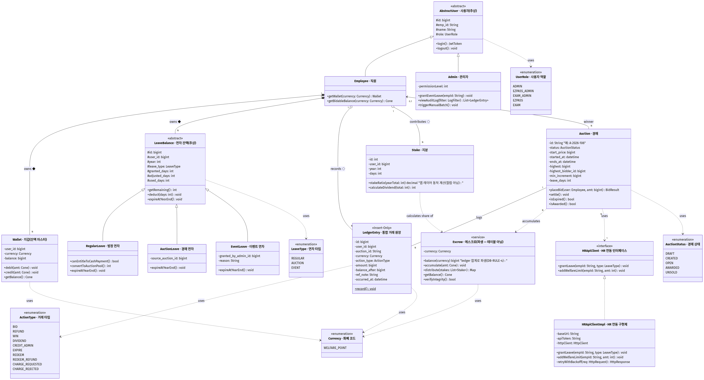

# ② 클래스 다이어그램 (Class Diagram)

**대상 시스템**: 연차 경매 시스템
**팀**: 타임소프트콘 (김기철, 오지석)
**렌더링**: https://mermaid.live (하단 코드 블록 복사 → 붙여넣기 → PNG 다운로드)

> **시스템 정적 구조** — 정식 UML classDiagram 문법 · 모든 관계 유형 포함

> ## ⚙️ 코드 기준 동기화 메모 (2026-06-12)
>
> 본 다이어그램은 **OO 설계 관점**(추상 계층/인터페이스/도메인 서비스)을 보여주며, 데이터 모델(속성·enum 값)은 실제 `backend/prisma/schema.prisma`에 맞춰 정정되었다. DB-레벨에서는 SQLite라 enum 블록이 없고 **String 컬럼 + CHECK 제약**으로 표현된다. 주요 정정:
> - **`UserRole`**: `EMPLOYEE`/`ADMIN` 2값이 아니라 `ADMIN`/`EZPASS_ADMIN`/`EXAM_ADMIN`/`EZPASS`/`EXAM` 5값.
> - **`AuctionStatus`**: 5값(`DRAFT`/`CREATED`/`OPEN`/`AWARDED`/`UNSOLD`) — `CLOSED`/`EXPIRED` 없음.
> - **`ActionType`**: 10값(`BID`/`REFUND`/`WIN`/`DIVIDEND`/`CREDIT_ADMIN`/`EXPIRE`/`REDEEM`/`REDEEM_REFUND`/`CHARGE_REQUESTED`/`CHARGE_REJECTED`).
> - **`LeaveBalance`**: `allocated_days` 단일이 아니라 `granted_days`+`adjusted_days`+`used_days`, **`deleted_at` 없음**.
> - **`Auction`**: PK는 String(예 `A-2026-106`), `started_at`/`ends_at`/`highest`/`highest_bidder_id`, **`year` 컬럼 없음**.
> - **`LedgerEntry`**: `escrow_balance_snapshot`/`reason` 아니라 `balance_after`(개인 지갑 잔액)/`ref_note`, 시각은 `occurred_at`.
> - **`Stake`**: `contributed_days`+`stake_ratio` 아니라 `days` 단일(지분 비율은 앱 레이어 동적 계산).
> - **`Escrow`**: 별도 테이블이 **아님** — `ledger_entry` 합계로 파생되는 도메인 서비스(`<<service>>`)로만 존재.
> - 멀티테넌시 `company_id`(FK→company)는 모든 테넌트 테이블에 존재(다이어그램은 단순화 위해 일부 생략).

---

## 🎯 설계 요소 커버리지

- ✅ **가시성** (`+` public, `-` private, `#` protected)
- ✅ **다중도** (`1`, `N`, `0..1`)
- ✅ **일반화** (Generalization, `<|--`): AbstractUser → Employee/Admin, LeaveBalance → 3종(Regular/Auction/Event)
- ✅ **실체화** (Realization, `<|..`): HRApiClient → HRApiClientImpl
- ✅ **컴포지션** (Composition, `*--`): Employee ◆— LeaveBalance
- ✅ **집합** (Aggregation, `o--`): Employee ◇— LedgerEntry
- ✅ **연관** (Association, `-->`): Auction → Winner
- ✅ **의존** (Dependency, `..>`): Auction ⤏ Escrow, HRApiClient
- ✅ **스테레오타입**: `<<abstract>>`, `<<interface>>`, `<<enumeration>>`, `<<service>>`, `<<Insert-Only>>`

---

## 📋 클래스 한영 대조표

클래스 식별자(영문)는 코드·DB 스키마와 1:1 매핑되며, 한글 도메인명은 이해 보조용입니다.

| 식별자 | 한글 도메인명 | 유형 |
|---|---|---|
| `AbstractUser` | 사용자(추상) | abstract class |
| `Employee` | 직원 | class |
| `Admin` | 관리자 | class |
| `LeaveBalance` | 연차 잔액(추상) | abstract class |
| `RegularLeave` | 법정 연차 | class |
| `AuctionLeave` | 경매 연차 | class |
| `EventLeave` | 이벤트 연차 | class |
| `Auction` | 경매 | class |
| `LedgerEntry` | 콘 거래 대장 | class (Insert-Only) |
| `Stake` | 지분 | class |
| `Escrow` | 에스크로 (중앙 수익금 대장) | service |
| `HRApiClient` | HR 연동 인터페이스 | interface |
| `HRApiClientImpl` | HR 연동 구현체 | class |
| `LeaveType` | 연차 타입 | enumeration |
| `AuctionStatus` | 경매 상태 | enumeration |
| `ActionType` | 거래 타입 | enumeration |
| `UserRole` | 사용자 역할 | enumeration |

---

## 📊 다이어그램

```mermaid
classDiagram
    direction TB

    %% ============================================================
    %% ② Class Diagram — 연차 경매 시스템
    %% ※ 클래스 라벨: "식별자 · 한글도메인명"  (식별자는 코드와 1:1 매핑)
    %% ============================================================

    %% ---------- Abstract Base Classes ----------
    class AbstractUser["AbstractUser · 사용자(추상)"] {
        <<abstract>>
        #id: bigint
        #emp_id: String
        #name: String
        #role: UserRole
        +login() JwtToken
        +logout() void
    }

    class Employee["Employee · 직원"] {
        +getWallet(currency: Currency) Wallet
        +getBidableBalance(currency: Currency) Cone
    }

    class Wallet["Wallet · 지갑(잔액 마스터)"] {
        -user_id: bigint
        -currency: Currency
        -balance: bigint
        +debit(amt: Cone) void
        +credit(amt: Cone) void
        +getBalance() Cone
    }

    class Admin["Admin · 관리자"] {
        -permissionLevel: int
        +grantEventLeave(empId: String) void
        +viewAuditLog(filter: LogFilter) List~LedgerEntry~
        +triggerManualBatch() void
    }

    AbstractUser <|-- Employee
    AbstractUser <|-- Admin

    %% ---------- Leave Balance Hierarchy ----------
    class LeaveBalance["LeaveBalance · 연차 잔액(추상)"] {
        <<abstract>>
        #id: bigint
        #user_id: bigint
        #year: int
        #leave_type: LeaveType
        #granted_days: int
        #adjusted_days: int
        #used_days: int
        +getRemaining() int
        +deduct(days: int) void
        +expireAtYearEnd()* void
    }

    class RegularLeave["RegularLeave · 법정 연차"] {
        +canEntitleToCashPayment() bool
        +convertToAuctionPool() int
        +expireAtYearEnd() void
    }

    class AuctionLeave["AuctionLeave · 경매 연차"] {
        -source_auction_id: bigint
        +expireAtYearEnd() void
    }

    class EventLeave["EventLeave · 이벤트 연차"] {
        -granted_by_admin_id: bigint
        -reason: String
        +expireAtYearEnd() void
    }

    LeaveBalance <|-- RegularLeave
    LeaveBalance <|-- AuctionLeave
    LeaveBalance <|-- EventLeave

    %% ---------- Core Entities ----------
    class Auction["Auction · 경매"] {
        -id: String "예: A-2026-106"
        -status: AuctionStatus
        -start_price: bigint
        -started_at: datetime
        -ends_at: datetime
        -highest: bigint
        -highest_bidder_id: bigint
        -min_increment: bigint
        -leave_days: int
        +placeBid(user: Employee, amt: bigint) BidResult
        +settle() void
        +isExpired() bool
        +isAwarded() bool
    }

    class LedgerEntry["LedgerEntry · 통합 거래 원장"] {
        <<Insert-Only>>
        -id: bigint
        -user_id: bigint
        -auction_id: String
        -currency: Currency
        -action_type: ActionType
        -amount: bigint
        -balance_after: bigint
        -ref_note: String
        -occurred_at: datetime
        +record()$ void
    }

    class Stake["Stake · 지분"] {
        -id: int
        -user_id: bigint
        -year: int
        -days: int
        +stakeRatio(yearTotal: int) decimal "앱 레이어 동적 계산(컬럼 아님)"
        +calculateDividend(total: int) int
    }

    %% ---------- Service ----------
    %% 주의: Escrow는 DB 테이블이 아니라 ledger_entry 합계로 파생되는 도메인 서비스.
    class Escrow["Escrow · 에스크로(파생 — 테이블 아님)"] {
        <<service>>
        -currency: Currency
        +balance(currency) bigint "ledger 합계로 파생(DB-RULE-4)"
        +accumulate(amt: Cone) void
        +distribute(stakes: List~Stake~) Map
        +getBalance() Cone
        +verifyIntegrity() bool
    }

    %% ---------- Interface & Realization ----------
    class HRApiClient["HRApiClient · HR 연동 인터페이스"] {
        <<interface>>
        +grantLeave(empId: String, type: LeaveType) void
        +addWelfareLimit(empId: String, amt: int) void
    }

    class HRApiClientImpl["HRApiClientImpl · HR 연동 구현체"] {
        -baseUrl: String
        -apiToken: String
        -httpClient: HttpClient
        +grantLeave(empId: String, type: LeaveType) void
        +addWelfareLimit(empId: String, amt: int) void
        -retryWithBackoff(req: HttpRequest) HttpResponse
    }

    HRApiClient <|.. HRApiClientImpl

    %% ---------- Enumerations ----------
    class LeaveType["LeaveType · 연차 타입"] {
        <<enumeration>>
        REGULAR
        AUCTION
        EVENT
    }

    class AuctionStatus["AuctionStatus · 경매 상태"] {
        <<enumeration>>
        DRAFT
        CREATED
        OPEN
        AWARDED
        UNSOLD
    }

    class ActionType["ActionType · 거래 타입"] {
        <<enumeration>>
        BID
        REFUND
        WIN
        DIVIDEND
        CREDIT_ADMIN
        EXPIRE
        REDEEM
        REDEEM_REFUND
        CHARGE_REQUESTED
        CHARGE_REJECTED
    }

    class UserRole["UserRole · 사용자 역할"] {
        <<enumeration>>
        ADMIN
        EZPASS_ADMIN
        EXAM_ADMIN
        EZPASS
        EXAM
    }

    class Currency["Currency · 화폐 코드"] {
        <<enumeration>>
        WELFARE_POINT
    }

    %% ---------- Relationships ----------
    Employee "1" *-- "N" Wallet : owns ◆
    Employee "1" *-- "N" LeaveBalance : owns ◆
    Employee "1" o-- "N" LedgerEntry : records ◇
    Employee "1" o-- "N" Stake : contributes ◇
    Employee "0..1" <-- "N" Auction : winner

    Auction "1" -- "N" LedgerEntry : logs
    Auction "N" ..> "1" Escrow : accumulates
    Auction "N" ..> "1" HRApiClient : uses

    LeaveBalance ..> LeaveType : uses
    Auction ..> AuctionStatus : uses
    LedgerEntry ..> ActionType : uses
    LedgerEntry ..> Currency : uses
    Wallet ..> Currency : uses
    Escrow ..> Currency : uses
    AbstractUser ..> UserRole : uses

    Stake ..> Escrow : calculates share of
```

### 🖼️ 렌더링 결과

> 📸 mermaid.live에서 렌더링한 이미지. 소스 변경 시 재렌더링하여 `class.png`로 덮어쓰기.
> ⚠️ **소스 갱신됨 (2026-06-12, 코드 동기화)**: 데이터 모델 속성/enum 값을 `schema.prisma`에 맞게 정정(아래 본문 참고). `class.png`는 **재렌더 필요**. 재생성: `python presentation/render-uml.py`.

---

## 📝 관계 유형별 카운트

| 관계 유형 | 기호 | 건수 | 예시 |
|---|---|---|---|
| 일반화 (Generalization) | `<\|--` ▷ | **5** | AbstractUser ← Employee/Admin, LeaveBalance ← 3종 |
| 실체화 (Realization) | `<\|..` ▷(점선) | **1** | HRApiClient ← HRApiClientImpl |
| 컴포지션 (Composition) | `*--` ◆ | **2** | Employee ◆— Wallet, Employee ◆— LeaveBalance (생명주기 종속) |
| 집합 (Aggregation) | `o--` ◇ | **2** | Employee ◇— LedgerEntry, Stake |
| 연관 (Association) | `--` 또는 `-->` | **2** | Auction → Winner, Auction — Log |
| 의존 (Dependency) | `..>` | **10** | Auction→Escrow, Auction→HRApiClient, Stake→Escrow, LeaveBalance→LeaveType, Auction→AuctionStatus, LedgerEntry→ActionType/Currency, Wallet→Currency, Escrow→Currency, AbstractUser→UserRole |

## 🏷️ 스테레오타입 사용

| 스테레오타입 | 적용 클래스 | 의미 |
|---|---|---|
| `<<abstract>>` | AbstractUser, LeaveBalance | 인스턴스화 불가, 하위 클래스 강제 |
| `<<interface>>` | HRApiClient | 구현체 교체 가능 (Mock/실제) |
| `<<service>>` | Escrow | 도메인 서비스 (상태는 집계만) |
| `<<enumeration>>` | LeaveType, AuctionStatus, ActionType, UserRole, Currency | 열거형 |
| `<<Insert-Only>>` | LedgerEntry | UPDATE/DELETE 금지 (DB-RULE-1) |

## 🔑 주요 설계 근거

- **AbstractUser 일반화** → [ADR-002](../../04_decisions/ADR-002-leave-type-flag.md) 역할 분리, Admin 권한 격리
- **LeaveBalance 3종 일반화** → [ADR-002](../../04_decisions/ADR-002-leave-type-flag.md) 이중 보상 방지, 각 서브타입의 `expireAtYearEnd()` 다형성
- **HRApiClient 인터페이스** → [ADR-005](../../04_decisions/ADR-005-hr-api-timing.md) 구현체 교체 가능 (테스트용 Mock / Outbox Worker)
- **Escrow `<<service>>`** → [ADR-001](../../04_decisions/ADR-001-escrow-model.md) 상태 없는 도메인 서비스
- **Wallet 분리 + Currency enum** → [ADR-010](../../04_decisions/ADR-010-currency-abstraction.md) 통화 추상화, [ADR-011](../../04_decisions/ADR-011-welfare-point-ownership.md) 잔액 마스터 본 시스템 보유
- **LedgerEntry 통합 원장** → [ADR-010](../../04_decisions/ADR-010-currency-abstraction.md)·[ADR-011](../../04_decisions/ADR-011-welfare-point-ownership.md) `currency`/`reason` 컬럼 추가, `CREDIT_ADMIN` 액션
- **AuctionStatus 5상태** (`DRAFT`/`CREATED`/`OPEN`/`AWARDED`/`UNSOLD`) → [ADR-014](../../04_decisions/ADR-014-auction-state-pattern.md) State 패턴은 [CUT-3](../../06_tech/scope-cuts.md)으로 status 문자열+guard로 축소(코드 기준)

---

## 🧭 내비게이션

| | 문서 |
|---|---|
| ⬅️ 이전 | [① 유스케이스 다이어그램](01-use-case.md) |
| ↩️ 인덱스 | [UML 인덱스](../UML.md) |
| ➡️ 다음 | [③ 순차 다이어그램](03-sequence.md) |
| 📚 관련 | [ERD](../erd.md) · [db-schema.sql](../../06_tech/db-schema.sql) |
