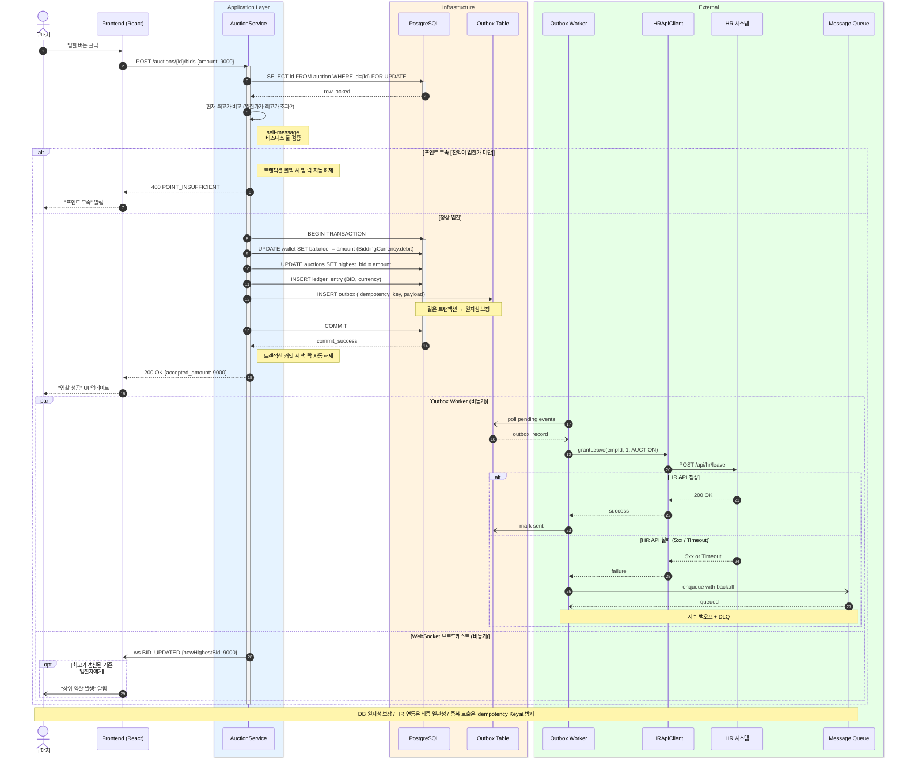
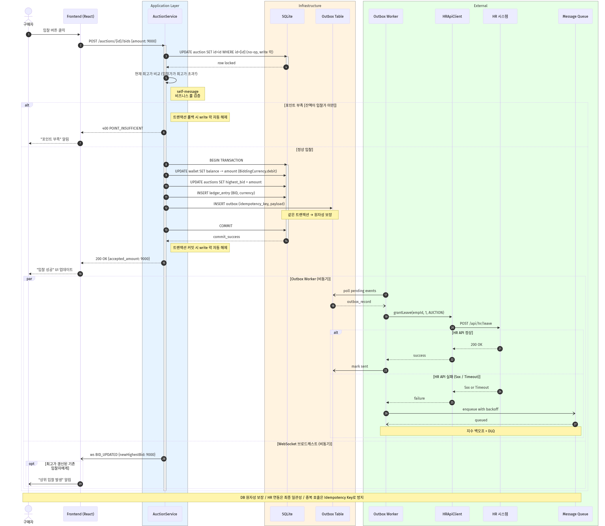

# ③ 순차 다이어그램 (Sequence Diagram)

**대상 시나리오**: 입찰 → 낙찰 → HR 연차 권한 부여 (FR-2.1 / FR-2.2 / FR-2.3)
**참여 액터**: **구매자(Buyer)** — 경매 입찰 역할의 직원
**팀**: 타임소프트콘 (김기철, 오지석)
**렌더링**: https://mermaid.live (하단 코드 블록 복사 → 붙여넣기 → PNG 다운로드)

> **Outbox Pattern 반영** ([ADR-005](../../04_decisions/ADR-005-hr-api-timing.md)) — 동기·비동기·반환 메시지 완전 구분

---

## 🎯 설계 요소 커버리지

- ✅ **동기 메시지** (`->>`, solid arrow)
- ✅ **비동기 메시지** (`-)`, open arrow) — WebSocket, Outbox, MQ
- ✅ **반환 메시지** (`-->>`, dashed arrow) / 비동기 반환 (`--)`)
- ✅ **자기-메시지** (self-message) — 현재 최고가 비교
- ✅ **활성화 박스** (Activation) — `activate` / `deactivate`
- ✅ **`alt` 프레임** — 대체 흐름 (성공/실패)
- ✅ **`par` 프레임** — 병렬 처리 (Outbox Worker + WebSocket)
- ✅ **`opt` 프레임** — 조건부 실행
- ✅ **`Note`** — 제약조건 및 주석
- ✅ **`box`** — 참여자 그룹핑

---

## 📊 다이어그램

### 🖼️ 렌더링 결과

> 📸 mermaid.live에서 렌더링한 이미지. 소스 변경 시 재렌더링하여 `sequence.png`로 덮어쓰기.
> ⚠️ **재렌더링 필요** (2026-05-14): `users.current_point` → `wallet.balance`(BiddingCurrency.debit), `point_transaction_log` → `ledger_entry` 반영됨. PNG는 아직 구버전.

---

## 📝 메시지 유형별 카운트

| 메시지 유형 | Mermaid 문법 | 건수 | 예시 |
|---|---|---|---|
| 동기 (Sync) | `->>` | 15+ | API 호출, DB 쿼리, 락 획득 |
| 반환 (Return) | `-->>` | 8+ | 락 획득 결과, COMMIT 결과, HR 응답 |
| 비동기 (Async) | `-)` | 5+ | WebSocket, Outbox poll, MQ enqueue |
| 비동기 반환 | `--)` | 2 | Outbox poll 응답, MQ queued |
| 자기-메시지 | `A ->> A` | 1 | 최고가 비교 |

## 🧩 프레임 사용

| 프레임 | 용도 |
|---|---|
| `alt / else` | 포인트 부족 분기, HR API 성공/실패 |
| `par / and` | Outbox Worker + WebSocket 브로드캐스트 병렬 |
| `opt` | 조건부 WebSocket 알림 (기존 입찰자만) |
| `box` | 참여자 그룹핑 (Infrastructure, External) |
| `Note` | 제약조건 및 원자성 설명 |

## 📎 ADR 매핑

| 메시지 | ADR |
|---|---|
| MySQL 행 락 (②) | scope-cuts CUT-1 ([ADR-006](../../04_decisions/ADR-006-redis-lock.md) Superseded) |
| `wallet` 차감 (⑤ — BiddingCurrency.debit) | [ADR-010](../../04_decisions/ADR-010-currency-abstraction.md) · [ADR-011](../../04_decisions/ADR-011-welfare-point-ownership.md) |
| `ledger_entry` INSERT (⑤) | [ADR-010](../../04_decisions/ADR-010-currency-abstraction.md) |
| Outbox INSERT (⑥) | [**ADR-005**](../../04_decisions/ADR-005-hr-api-timing.md) |
| Outbox Worker 폴링 (⑨) | [ADR-005](../../04_decisions/ADR-005-hr-api-timing.md) |
| Idempotency Key | [ADR-005](../../04_decisions/ADR-005-hr-api-timing.md) |

---

## 🧭 내비게이션

| | 문서 |
|---|---|
| ⬅️ 이전 | [② 클래스 다이어그램](02-class.md) |
| ↩️ 인덱스 | [UML 인덱스](../UML.md) |
| ➡️ 다음 | [④ 상태 다이어그램](04-state.md) |
| 📚 관련 | [API 명세](../api-spec.md) · [아키텍처](../architecture.md) |
