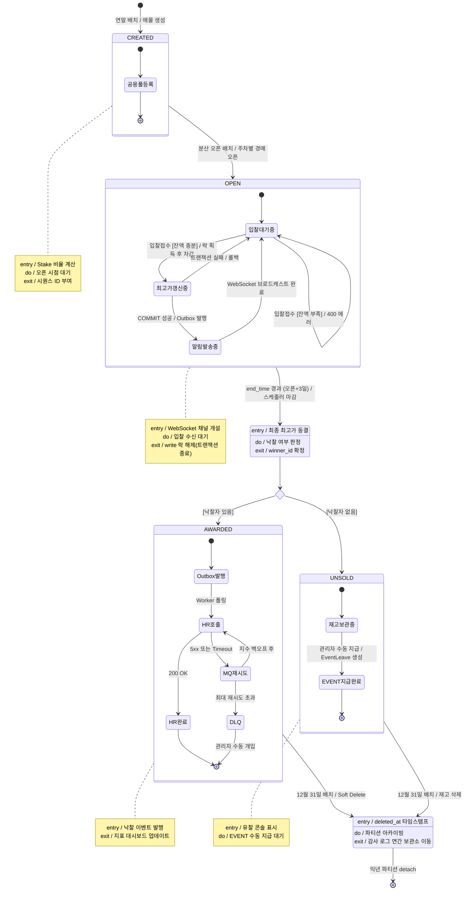

# ④ 상태 다이어그램 (State Diagram)

**대상 객체**: `Auction` (경매)
**팀**: 타임소프트콘 (김기철, 오지석)
**렌더링**: https://mermaid.live (하단 코드 블록 복사 → 붙여넣기 → PNG 다운로드)

> **Auction 객체 생애주기** — 6 상태 · 4 복합(Composite) 상태 · `<<choice>>` 의사상태 · entry/do/exit 액션 완비

---

## 🎯 설계 요소 커버리지

- ✅ **초기/종료 의사상태** (`[*]`)
- ✅ **복합 상태** (Composite State) — CREATED, OPEN, AWARDED, UNSOLD
- ✅ **Choice 의사상태** (`<<choice>>`) — CLOSED 이후 분기
- ✅ **entry / do / exit 액션** — 모든 주요 상태에 명시
- ✅ **전이 표기**: `trigger [guard] / action` 정식 형식
- ✅ **자기-전이** (self-transition) — Guard `[잔액 부족]` (입찰대기중 self-loop)

---

## 📊 다이어그램

### 🖼️ 렌더링 결과

> 📸 mermaid.live에서 렌더링한 이미지. 소스 변경 시 재렌더링하여 `state.png`로 덮어쓰기.
> ✅ **최신 렌더 완료** (2026-05-27, kroki): "분산 오픈 배치(주차별)"([business-rules.md](../../02_requirements/business-rules.md) OP-4)가 반영된 현재 소스로 재렌더됨. 재생성: `python presentation/render-uml.py`.

---

## 📝 상태별 상세

| 상태 | 유형 | entry 액션 | do 액션 | exit 액션 |
|---|---|---|---|---|
| **CREATED** | Composite | Stake 비율 계산 | 오픈 시점 대기 | 시퀀스 ID 부여 |
| **OPEN** | Composite | WebSocket 채널 개설 | 입찰 수신 대기 | write 락 해제(트랜잭션 종료) |
| **CLOSED** | Simple | 최종 최고가 동결 | 낙찰 여부 판정 | winner_id 확정 |
| **AWARDED** | Composite | 낙찰 이벤트 발행 | — | 지표 대시보드 업데이트 |
| **UNSOLD** | Composite | 유찰 콘솔 표시 | EVENT 수동 지급 대기 | — |
| **EXPIRED** | Simple | deleted_at 타임스탬프 | 파티션 아카이빙 | 감사 로그 이동 |

## 🔀 전이 테이블

> 💡 **표기 원칙**: 다이어그램 내부는 **자연어 가드**(`[잔액 충분]`), 본 테이블은 **정밀 수식**으로 구현 기준을 병기. 두 표현은 의미상 동치.

| From | To | Trigger | Guard (정밀 수식) | 다이어그램 표기 | Action |
|---|---|---|---|---|---|
| `[*]` | CREATED | 연말 배치 실행 | `REGULAR 미사용 > 0` | `[REGULAR 미사용 보유]` | 매물 생성 |
| CREATED | OPEN | 분산 오픈 배치 (매주) | `year == currentYear AND 주차별 오픈 쿼터 미소진` | `[오픈 차례 도달]` | 경매 오픈 (start_time 확정) |
| 입찰대기중 | 최고가갱신중 | 입찰접수 | `wallet.balance ≥ amount AND amount ≥ highest_bid + 최소증분` | `[잔액 충분]` | 락+차감+직전자 환불+로그 |
| 입찰대기중 | 입찰대기중 | 입찰접수 | `wallet.balance < amount` | `[잔액 부족]` | 400 반환 (self-transition) |
| OPEN | CLOSED | end_time 경과 | — | — | 마감 처리 |
| CLOSED | AWARDED | choice | `winner_id != null AND highest_bid > 0` | `[낙찰자 있음]` | — |
| CLOSED | UNSOLD | choice | `winner_id == null` | `[낙찰자 없음]` | — |
| UNSOLD | EVENT지급완료 | 관리자 수동 지급 | `user.role == ADMIN` | (다이어그램엔 guard 생략) | EventLeave 생성 |
| AWARDED/UNSOLD | EXPIRED | 12월 31일 배치 | — | — | Soft Delete |
| EXPIRED | `[*]` | 익년 파티션 detach | — | — | 아카이빙 완료 |

## 📖 주요 용어 빠른 참조

AWARDED 복합 상태 내부에서 사용된 메시지 큐 관련 용어 (상세: [용어집 D 섹션](../../02_requirements/glossary.md#d-기술아키텍처-용어))

| 용어 | 한 줄 설명 |
|---|---|
| **MQ** (Message Queue) | 비동기 메시지 대기열. 지금 처리 못 하는 요청을 줄 세워두고 나중에 순서대로 처리. (예: RabbitMQ, Kafka, SQS) |
| **MQ재시도** | HR API 호출 실패 시 MQ에 요청을 넣어두고 일정 시간 후 다시 시도하는 상태 |
| **지수 백오프** | 재시도 간격을 2배씩 늘림 (5s → 10s → 20s → 40s). 과부하 방지 + 장애 회복 시간 확보 |
| **DLQ** (Dead Letter Queue) | "죽은 편지함". 재시도 최대치 초과해도 실패한 메시지의 최종 격리소. **관리자 수동 개입 필요** 신호. |
| **Worker 폴링** | Outbox 테이블을 주기적으로 조회해 미발행 메시지를 꺼내 HR API로 보내는 별도 프로세스 |

## 🔑 주요 설계 근거

- **OPEN Composite State** → 입찰 동시성의 내부 흐름을 1 상태로 은닉 + 실시간 WebSocket 통합
- **`<<choice>>` 의사상태** → CLOSED 이후 낙찰/유찰 분기를 UML 표준으로 명시
- **AWARDED 내부의 MQ재시도/DLQ** → [ADR-005](../../04_decisions/ADR-005-hr-api-timing.md) Outbox Pattern의 실패 시나리오 반영
- **12/31 배치 단일 수렴** → [ADR-004](../../04_decisions/ADR-004-year-partitioning.md) year 기준 파티셔닝의 귀결
- **6개 상태의 코드 구현** → [ADR-014](../../04_decisions/ADR-014-auction-state-pattern.md) GoF State 패턴 — 각 상태를 객체로, `auction.status` enum은 어댑터 경계에서 매핑
- **분산 오픈 (CREATED → OPEN 주차별)** → [business-rules.md](../../02_requirements/business-rules.md) OP-4. 1/1 전량 동시 오픈 아님
- **입찰 전이의 직전자 즉시 환불** → [ADR-018](../../04_decisions/ADR-018-auction-settlement-rules.md) 패자 즉시 환불

---

## 🧭 내비게이션

| | 문서 |
|---|---|
| ⬅️ 이전 | [③ 순차 다이어그램](03-sequence.md) |
| ↩️ 인덱스 | [UML 인덱스](../UML.md) |
| 📚 관련 | [ADR-005](../../04_decisions/ADR-005-hr-api-timing.md) · [ADR-004](../../04_decisions/ADR-004-year-partitioning.md) |
