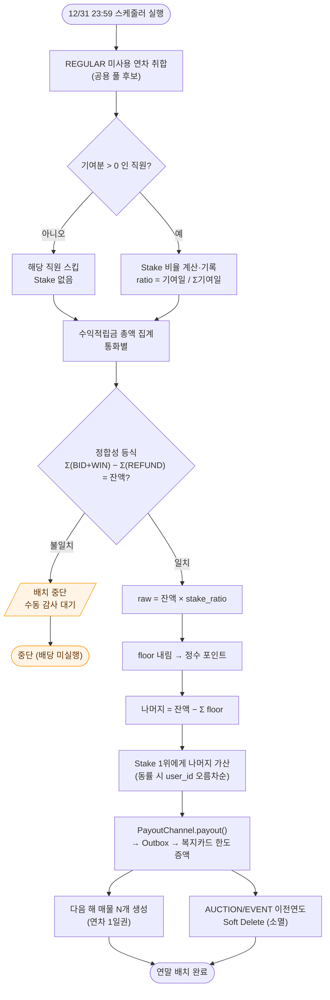
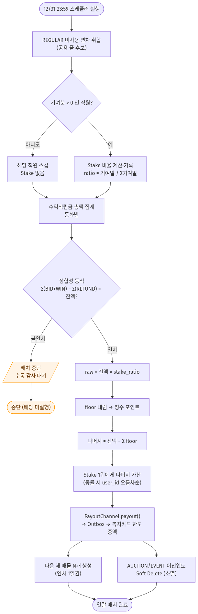

# ⑤ 활동 다이어그램 (Activity Diagram) — 연말 배치

**대상 프로세스**: 12/31 연말 정산·배당 배치 (FR-1.1 + FR-4.1)
**팀**: 타임소프트콘 (김기철, 오지석)
**렌더링**: https://mermaid.live (하단 코드 블록 복사 → 붙여넣기 → PNG 다운로드 → `activity-year-end.png`)

> **이 프로젝트의 심장** — 수익적립금(Escrow)에 쌓인 돈이 *어떻게 1원도 틀리지 않고* 기여자에게 배당되는지의 전체 흐름. 순차 다이어그램이 "입찰 1건"을 보여준다면, 이 다이어그램은 **1년 주기의 돈 흐름과 검증**을 보여준다.

---

## 🎯 설계 요소 커버리지

- ✅ **시작/종료 노드** (`([...])`)
- ✅ **결정(Decision) 노드** (`{...}`) 3건 — 기여분 유무 / 정합성 검증 / 낙찰 여부는 상태도 참조
- ✅ **분기·병합** — 정산 대상 0개 스킵, 검증 실패 시 중단
- ✅ **병렬 흐름(Fork)** — 매물 생성 ∥ 소멸 처리
- ✅ **가드(Guard) 표기** — `기여분 > 0`, `등식 성립`
- ✅ **예외 흐름** — 정합성 불일치 → 배치 중단 + 수동 감사

---

## 📊 다이어그램

### 🖼️ 렌더링 결과

> 📸 mermaid.live에서 렌더링 후 `activity-year-end.png`로 저장.

---

## 📝 핵심 흐름 설명

| 단계 | 행위 | 근거 |
|---|---|---|
| 1 | REGULAR 미사용 연차 취합 → 내년 매물 후보 | FR-1.1 |
| 2 | 기여자 Stake 비율 계산·기록 | business-rules §2.1 |
| 3 | **수익적립금 총액 집계 + 정합성 등식 검증** | NFR-2 / DB-RULE-4 |
| 3-예외 | 등식 불일치 → **배치 중단, 수동 감사** (배당 절대 미실행) | SRS FR-4.1 예외 |
| 4 | `floor` 내림 + **나머지를 Stake 1위에 가산** → `Σ배당 = 잔액` | business-rules §2.2 |
| 5 | PayoutChannel → Outbox → 복지카드 한도 증액 | ADR-005 / ADR-010 |
| 6 | 매물 생성 ∥ 이전연도 AUCTION/EVENT 소멸 (병렬) | ADR-004 / DB-RULE-2 |

> **왜 중요한가**: "총 배당 = 수익적립금 총액"이라는 [NFR-2](../../02_requirements/SRS.md#nfr-2-재무-정합성-및-감사-추적성-auditability) 불변식이 *검증 노드 → 산정 → 지급*의 순서로 강제됨을 한눈에 보여준다.

---

## 🧭 내비게이션

| | 문서 |
|---|---|
| ↩️ 인덱스 | [UML 인덱스](../UML.md) |
| ➡️ 관련 | [④ 상태](04-state.md) · [⑧ 활동(차감 우선순위)](08-activity-deduction.md) |
| 📚 근거 | [business-rules §2](../../02_requirements/business-rules.md) · [architecture §5.2](../architecture.md) · [ADR-001](../../04_decisions/ADR-001-escrow-model.md)·[ADR-008](../../04_decisions/ADR-008-year-end-dividend.md) |
