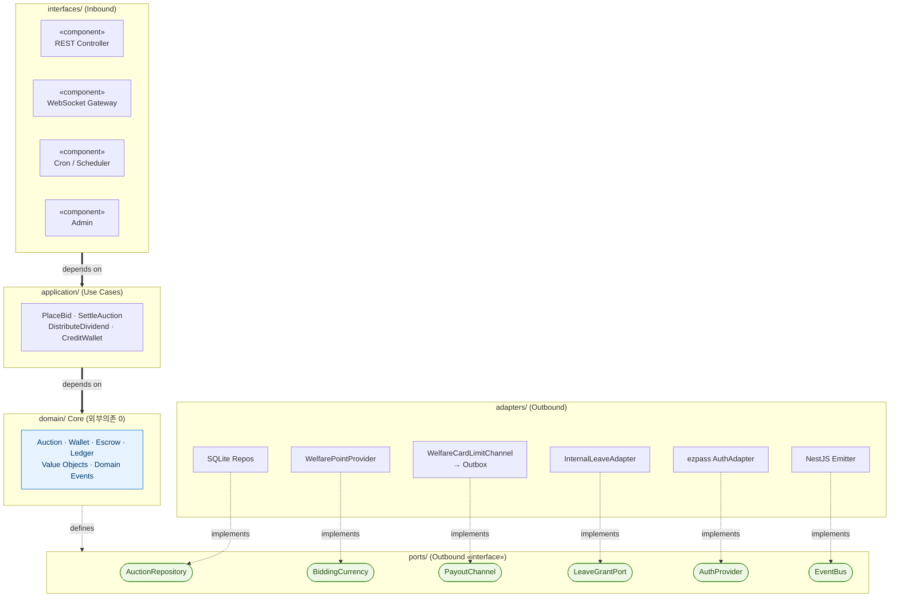
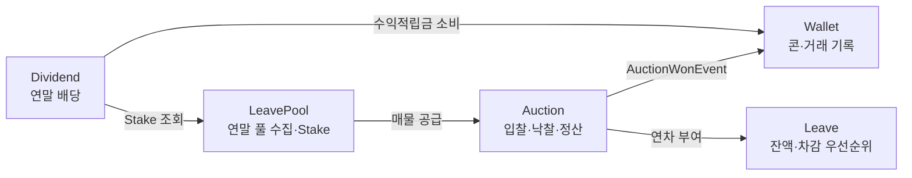
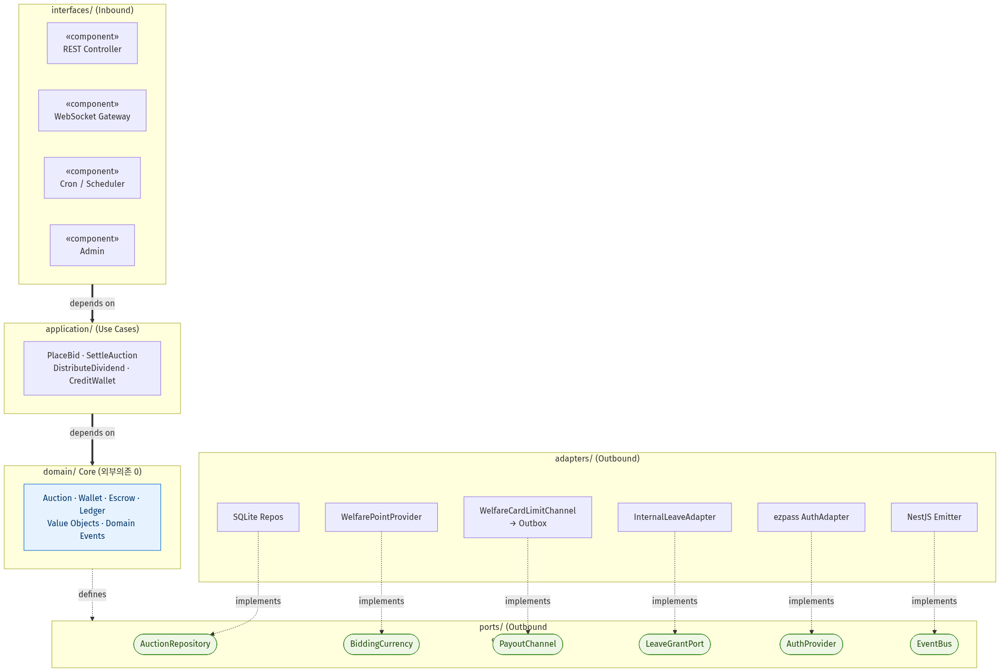

# ⑥ 컴포넌트 다이어그램 (Component Diagram) — Hexagonal Ports & Adapters

**대상**: 시스템 정적 구조 (ADR-012 Hexagonal Architecture)
**팀**: 타임소프트콘 (김기철, 오지석)
**렌더링**: https://mermaid.live (→ `component-hexagonal.png`)

> `architecture.md`의 ASCII 블록을 **정식 UML 컴포넌트 다이어그램**으로. 의존 방향(`adapters → ports → domain`)과 «interface» 포트, 어댑터 교체 가능성(OCP)을 표기로 입증한다.

---

## 🎯 설계 요소 커버리지

- ✅ **컴포넌트** (`«component»`) 5계층
- ✅ **«interface» 포트** (Outbound Port) — 제공/요구 인터페이스
- ✅ **실체화(Realization)** — 어댑터가 포트를 `implements`
- ✅ **의존 방향** — Inbound → Application → Domain ← Ports ← Adapters (의존은 항상 안쪽)
- ✅ **계층 경계** — `domain/`은 외부 라이브러리 의존 0 (ESLint boundaries 강제)

---

## 📊 다이어그램 1 — 계층/포트/어댑터

## 📊 다이어그램 2 — 5개 바운디드 컨텍스트 (Context Map)

### 🖼️ 렌더링 결과

> 📸 두 블록을 각각 렌더링하거나, 위 블록을 대표 이미지(`component-hexagonal.png`)로 저장.

---

## 📝 핵심 설계 근거

- **의존성 규칙**: `domain → 무의존`, `application → domain`, `adapters → ports → domain`. `eslint-plugin-boundaries`로 컴파일 타임 강제.
- **포트별 어댑터 교체 (OCP)**: `BiddingCurrency` → `WelfarePointProvider`(현재) / 미래 다른 화폐, `LeaveGrantPort` → `InternalLeaveAdapter`(현재) / `GroupwareLeaveAdapter`(미래). **코어 무수정**.
- **입찰·낙찰 경로 외부 호출 0**: `wallet`·`leave_balance`가 본 시스템 마스터 ([ADR-011]·[ADR-016]) → 단일 트랜잭션.

---

## 🧭 내비게이션

| | 문서 |
|---|---|
| ↩️ 인덱스 | [UML 인덱스](../UML.md) |
| 📚 근거 | [architecture.md §2·§8](../architecture.md) · [ADR-012](../../04_decisions/ADR-012-hexagonal-architecture.md)·[ADR-010](../../04_decisions/ADR-010-currency-abstraction.md)·[ADR-017](../../04_decisions/ADR-017-leave-pool-context.md) |
