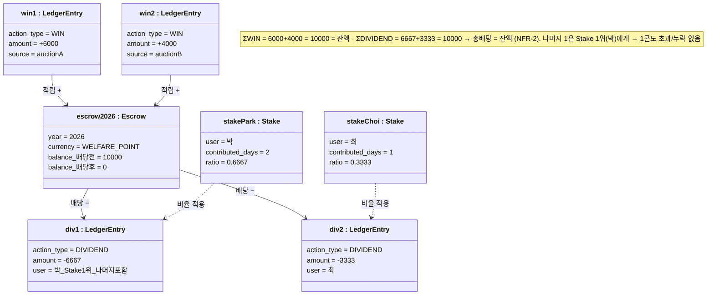
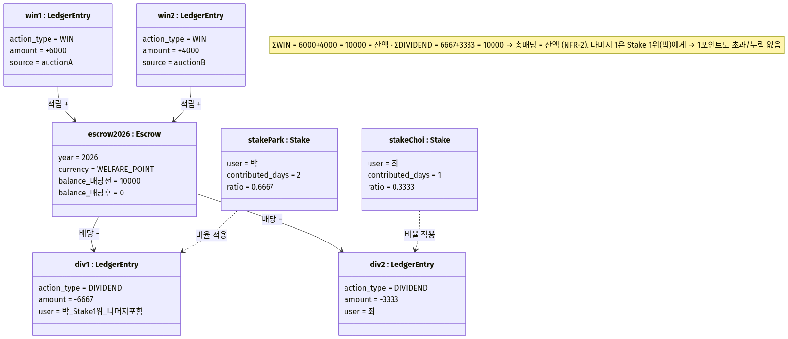

# ⑦ 객체 다이어그램 (Object Diagram) — 수익적립금 정합성 스냅샷

**대상**: 특정 시점(연말 배당 직전/직후)의 인스턴스 스냅샷
**팀**: 타임소프트콘 (김기철, 오지석)
**렌더링**: https://mermaid.live (→ `object-integrity.png`)

> NFR-2 등식 `Σ(BID+WIN) − Σ(REFUND+DIVIDEND) = 수익적립금 잔액`을 **실제 숫자가 박힌 인스턴스**로 증명한다. 클래스 다이어그램이 *타입*이라면, 이 다이어그램은 *값*이다.

---

## 🎯 시나리오 (구체 수치)

- 경매 A 낙찰 → 수익적립금 +6000 / 경매 B 낙찰 → +4000 ⇒ **수익적립금 잔액 = 10000**
- 기여자 지분: 박 2일(2/3 ≈ 0.6667), 최 1일(1/3 ≈ 0.3333)
- 배당 산정: 박 raw 6666.67 → floor 6666, 최 raw 3333.33 → floor 3333 (Σfloor = 9999)
- **나머지 1 → Stake 1위(박)에게 가산** ⇒ 박 6667, 최 3333 (Σ = 10000)

---

## 📊 다이어그램

### 🖼️ 렌더링 결과

> 📸 mermaid.live에서 렌더링 후 `object-integrity.png`로 저장.

---

## 📝 무엇을 증명하나

| 불변식 | 이 스냅샷에서의 확인 |
|---|---|
| 적립 정합성 | `ΣWIN(6000+4000) = escrow.balance(10000)` |
| **배당 = 잔액 (NFR-2)** | `ΣDIVIDEND(6667+3333) = 10000` → 배당 후 잔액 0 |
| 나머지 처리 (business-rules §2.2) | floor 합 9999, 나머지 1 → Stake 1위(박) → 6667 |
| 원장 불변 (DB-RULE-1) | 모든 변동이 `LedgerEntry` INSERT로 기록 (WIN/DIVIDEND) |

> 통화별로 분리 집계되며(DB-RULE-4), `CREDIT_ADMIN`은 이 등식에서 제외된다.

---

## 🧭 내비게이션

| | 문서 |
|---|---|
| ↩️ 인덱스 | [UML 인덱스](../UML.md) |
| 📚 근거 | [SRS NFR-2](../../02_requirements/SRS.md) · [business-rules §2.2](../../02_requirements/business-rules.md) · [② 클래스](02-class.md) |
