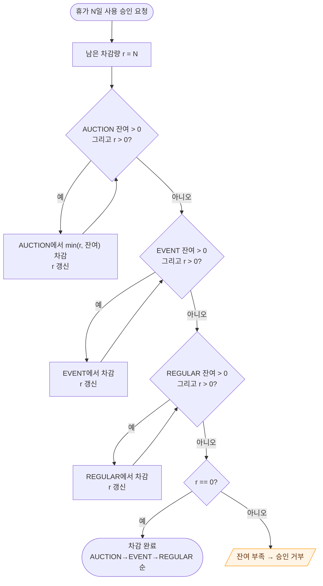
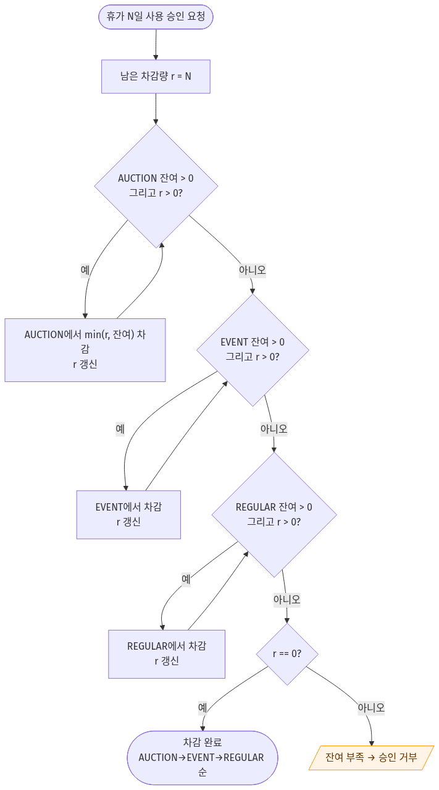

# ⑧ 활동 다이어그램 (Activity Diagram) — 휴가 차감 우선순위

**대상 프로세스**: 휴가 사용 승인 시 강제 차감 (FR-3.1 / ADR-003)
**팀**: 타임소프트콘 (김기철, 오지석)
**렌더링**: https://mermaid.live (→ `activity-deduction.png`)

> 사용자가 *어떤 연차를 쓸지 선택할 수 없다*. 시스템이 `AUCTION → EVENT → REGULAR` 순으로 **강제 차감**한다. 이 불변식이 경매 연차 소멸 클레임과 수당 이중 보상을 막는다.

---

## 🎯 설계 요소 커버리지

- ✅ **시작/종료 노드**
- ✅ **결정 노드** 4건 (AUCTION/EVENT/REGULAR 잔여 + 완료 판정)
- ✅ **자기-루프(self-loop)** — 한 속성 내 다회 차감 후 잔여 재확인
- ✅ **가드** — `잔여 > 0 그리고 r > 0`
- ✅ **예외 흐름** — 총 잔여 부족 시 승인 거부

---

## 📊 다이어그램

### 🖼️ 렌더링 결과

> 📸 mermaid.live에서 렌더링 후 `activity-deduction.png`로 저장.

---

## 📝 왜 이 순서인가 (ADR-003)

| 순위 | 속성 | 이유 |
|---|---|---|
| 1순위 | **AUCTION** | 연말 소멸 + 수당 제외 → **먼저 안 쓰면 사라짐**. 최우선 소진 |
| 2순위 | **EVENT** | 연말 소멸 + 수당 제외 → 다음 소진 |
| 3순위 | **REGULAR** | 수당 대상 + 다음 해 풀 전환 대상 → **최대한 보존** |

> 사용자 선택을 막는 이유: 사용자가 REGULAR를 먼저 쓰면 소멸 예정인 AUCTION이 버려져 클레임 발생. 백엔드 강제 차감으로 원천 차단.

---

## 🧭 내비게이션

| | 문서 |
|---|---|
| ↩️ 인덱스 | [UML 인덱스](../UML.md) |
| 📚 근거 | [SRS FR-3.1](../../02_requirements/SRS.md) · [ADR-002](../../04_decisions/ADR-002-leave-type-flag.md)·[ADR-003](../../04_decisions/ADR-003-forced-priority.md) |
